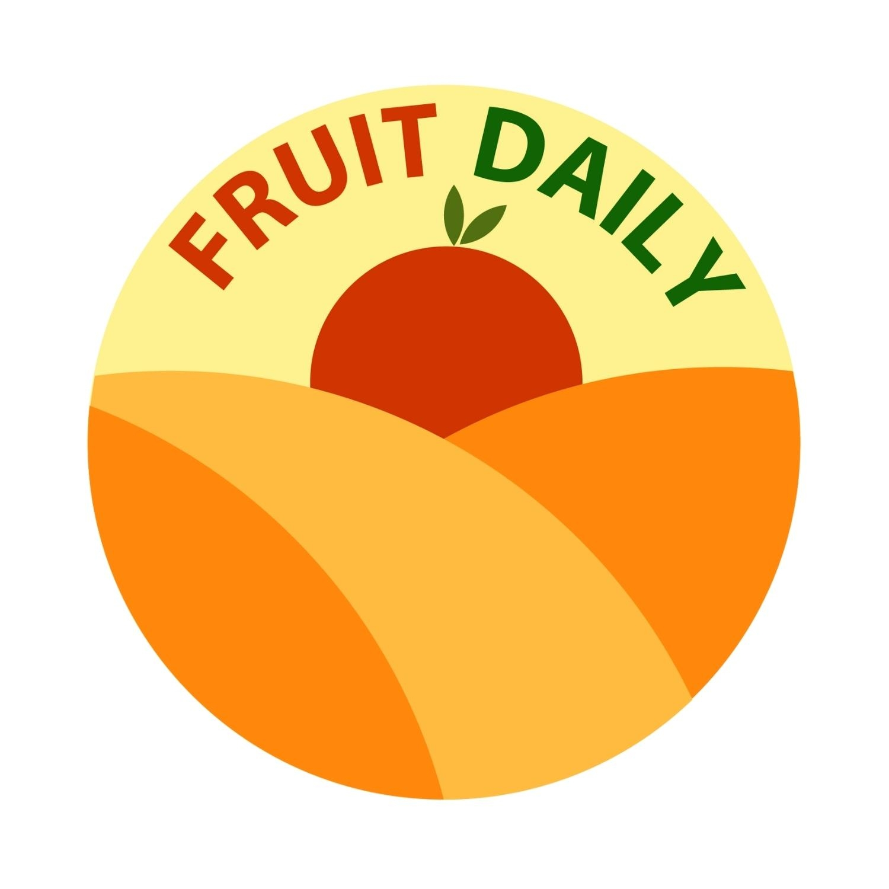
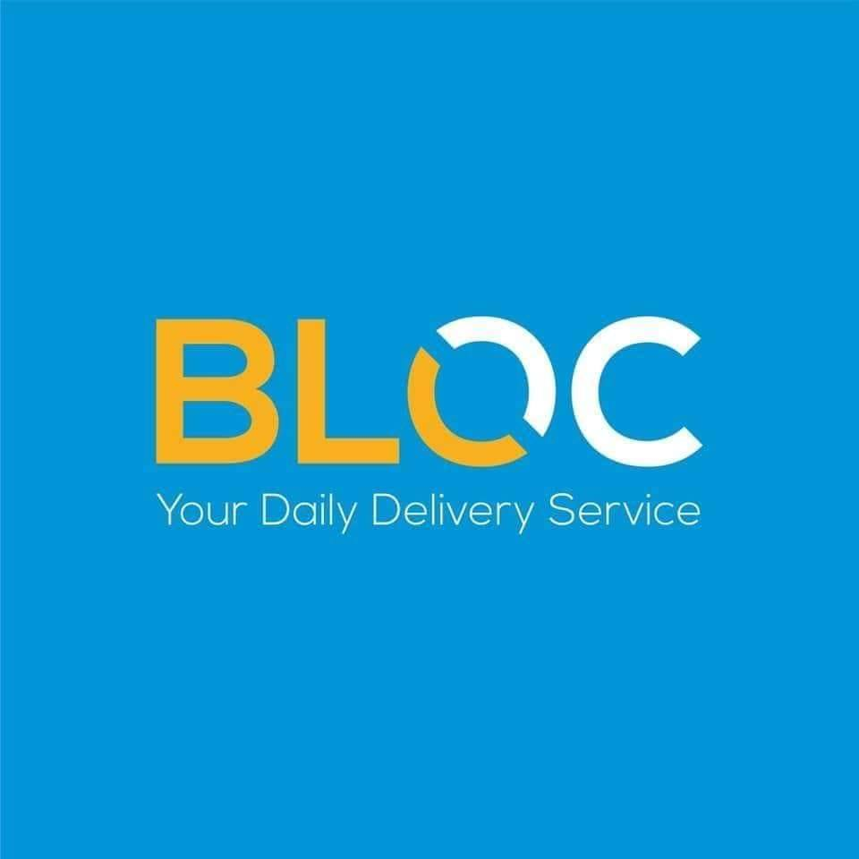

# 📱 Company Apps

This document showcases the apps I’ve been involved in — either as a developer who maintainer for **ongoing support and development**.

---

## 🚀 Apps Distributed on the App Store

These are the apps that have successfully published on the App Store.

**🍽️ Instafood**

<table>
  <tr>
    <td>
        
    </td>
    <td style="padding-left: 16px;">
      
<strong>🍽️  Instafood Kh</strong> is the E-commerce project. Having a clean architecture state managemnet <em>BLOC</em>. However this app contance <em>SOCKET</em> realtime chat & driver tracking with three flavor (dev, stg, pro).This app also intergrate with ABA payment method.

      <a href="https://apps.apple.com/kh/app/instafoodkh/id1246793337">View on App Store</a>
    </td>
  </tr>
  <tr>
    <td>
      
    </td>
    <td style="padding-left: 16px;">
      
<strong>🏪 Instafood Vendor</strong> is vendor project known as vedor app of Instafood. This's app also using <em>BLOC</em> state management with three flavor (dev, stg, pro).

      <a href="https://apps.apple.com/us/app/instafoodkh-vendor/id1568015546">View on App Store</a>
    </td>
  </tr>
  <tr>
    <td>
      
    </td>
    <td style="padding-left: 16px;">
      
<strong>🚗 Instafood Driver</strong> is the driver project known as driver app of Instafood. This's app alos using <em>BLOC</em> state management with three flavor (dev, stg, pro).

      <a href="https://apps.apple.com/us/app/instafoodkh-driver/id1568014447">View on App Store</a>
    </td>
  </tr>
</table>

---

## 🔧 Apps I've Worked On & Maintained

Here are apps I’ve contributed to through development, feature updates, and maintenance.

<table>
  <tr>
    <td>
        
    </td>
    <td style="padding-left: 16px;">
      
<strong>🍉 Fruit Daily</strong> is an online store project sell product. This's app have three favor (dev, stg, pro) using <em>BLOC</em> state management with cubit and provider.This app also intergrate with ABA payment method.

      <a href="https://apps.apple.com/kh/app/fruit-daily/id6473465952">View on App Store</a>
    </td>
  </tr>
  <tr>
    <td>
      
    </td>
    <td style="padding-left: 16px;">
      
<strong>📦 BLOC Delivery</strong> is an E-commerce project known as the Bloc-Delivery App in Cambodia. This app build in version 2. Using <em>BLOC</em> state management with three flavor (dev, stg, pro). Also integret payment gate way with ABA, KHQR, ACLEDA and have AI search product with image.

      <a href="https://apps.apple.com/kh/app/bloc-delivery/id1459499838">View on App Store</a>
    </td>
  </tr>
</table>
  
---

### 🙌 Thank you for checking out my work
