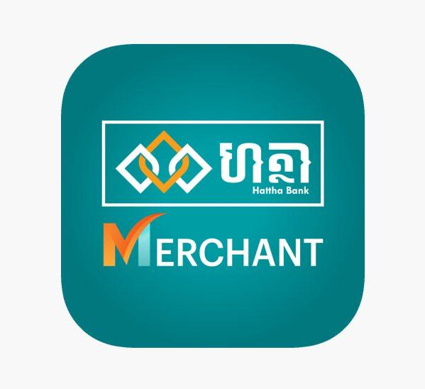

## 🏦 Hattha Bank

  <table>
  <tr>
    <td>
        
    </td>
    <td style="padding-left: 16px;">
      
<strong>🏦 Hattha Bank</strong> is a professional banking application where I was responsible for maintenance, implementing new features, enhancing performance, and fixing bugs. This app
      provides secure and convenient digital banking services to users.

      <a href="https://www.hatthabank.com/en">View Website</a>
    </td>
  </tr>
  <tr>
    <td>
        
    </td>
    <td style="padding-left: 16px;">
      
<strong>🏦 Hattha Merchant</strong> is a merchant banking application where I was responsible for maintenance, implementing new features, enhancing performance, and fixing bugs. Turn your smartphone into a powerful business tool with the Hattha Merchant App — the easiest way to accept KHQR payments and manage your sales. Whether you run one shop or many, the app helps you save time, reduce cash handling, and boost customer satisfaction.

      <a href="https://apps.apple.com/kh/app/hattha-merchant/id6736674062">View on App Store</a>
    </td>
  </tr>
  </table>

### 🙌 Thank you for visiting

Feel free to explore the links above and get in touch if you'd like to collaborate or learn more about my work.
