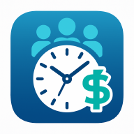
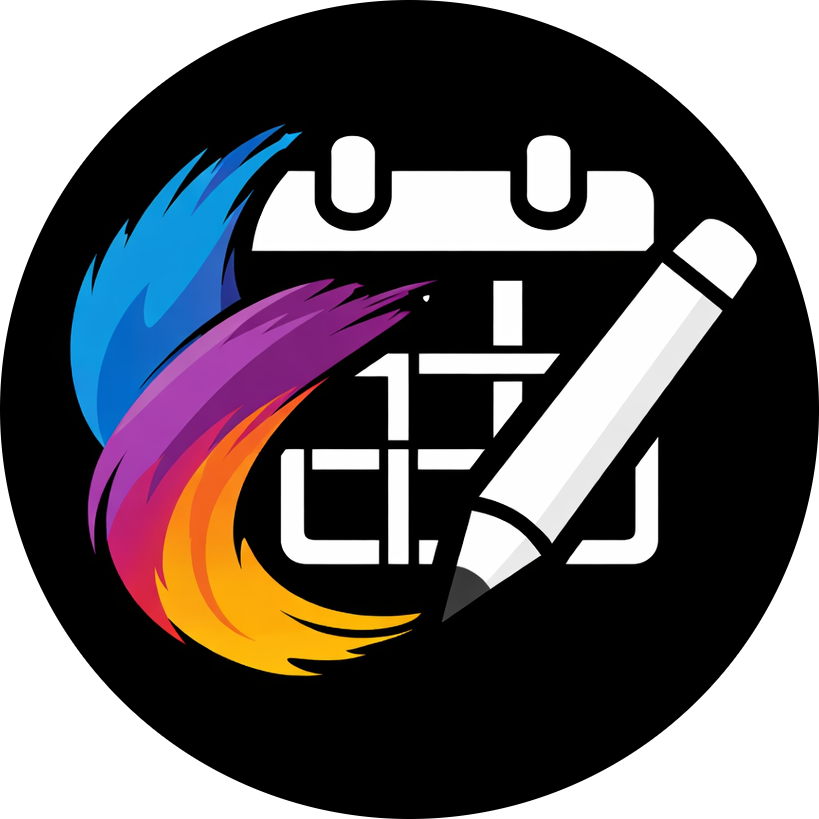

## 💻 Open Source Projects

These are apps I’ve worked on that are available as open source:

- **🕒 EMT (Employee Time Management)**

  <table>
  <tr>
    <td>
        
    </td>
    <td style="padding-left: 16px;">
      
<strong>🍽️  EMT</strong> is a self project build for my parents. This app help them to manage employee daily time of work with the money employee got. However this app contain voice when press on some button, change language support (khmer & english) and theme can change to darke mode.

      <a href="https://github.com/Puthsihta/employee_time_management">View on GitHub</a>
    </td>
  </tr>
  <tr>
    <td>
        
    </td>
    <td style="padding-left: 16px;">
      
<strong>💰 Moone</strong> 1st 2026 personal project inspire ✨ by my girlfriend 🩵. This app is kindda money management, friendly ui and user experience.

      <a href="https://github.com/puthsitha/moone">View on GitHub</a>
    </td>
  </tr>
  <tr>
    <td>
        
    </td>
    <td style="padding-left: 16px;">
      
<strong>🎨 Artistplanner 🗓️</strong> 2nd 2026 personal project inspire ✨ by from artist planner book 📕. This app is kindda self-improvment with the modern and fluture <strong>Glass UI</strong>.

      <a href="https://github.com/puthsitha/artist-planner">View on GitHub</a>
    </td>
  </tr>

</table>

---

### 🙌 Thank you for visiting

Feel free to explore the links above and get in touch if you'd like to collaborate or learn more about my work.
