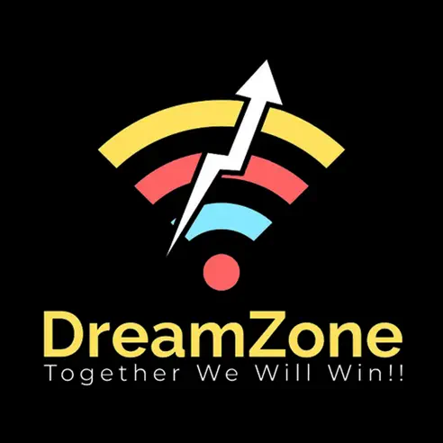
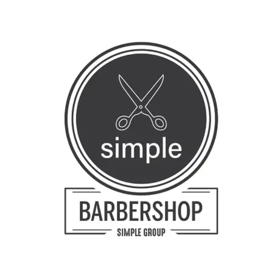

# 📱 My Published Apps

This company lists the apps I have developed and successfully distributed on the **App Store** and **Google Play Store**.

---

## 🛒 Available on App Store

   <table>
   <tr>
    <td>
        
    </td>
    <td style="padding-left: 16px;">
      
<strong>📚 Kou Sopheap</strong> is the Internal company project build for monk name Kou Sopheap. This app allow user to read book. and share the book (PDF) to other by dynamic link.

      <a href="https://apps.apple.com/us/app/kou-sopheap-book/id6446607020">View on App Store</a>
    </td>
  </tr>
  <tr>
    <td>
      
    </td>
    <td style="padding-left: 16px;">
      
<strong>🌙 Dream Zone</strong> is an E-commerce project. This app allow to have multi-sore with the feature add cart order, membership with level.

      <a href="https://apps.apple.com/us/app/dream-zone/id6447842263">View on App Store</a>
    </td>
  </tr>
  <tr>
    <td>
      
    </td>
    <td style="padding-left: 16px;">
      
<strong>💈 Simple Barber</strong> is the Barber project design for barber use. This app contain book service barber, top up with ABA(payment menthod), report of they work.

      <a href="https://apps.apple.com/us/app/simple-barber/id1661098670">View on App Store</a>
    </td>
  </tr>
</table>

---

## 📲 Available on Google Play Store

   <table>
   <tr>
    <td>
        
    </td>
    <td style="padding-left: 16px;">
      
<strong>🚗 TCR Auto Garage</strong> is the Garage project. This app allow user to book the service on real time. Also contain real time chat and direction location, listen to the audio of car knowledge and watch video. By the way this app have payment method with bank (ABA) top up and tranferce point, switch muliple cars in one Account.

      <a href="https://play.google.com/store/apps/details?id=com.tcr_user_app">View on App Store</a>
    </td>
  </tr>
  <tr>
    <td>
      
    </td>
    <td style="padding-left: 16px;">
      
<strong>🛠️ TCR Admin</strong> is admin project known as TCR app. This app manage booking and reply chat from customer app.

      <a href="https://play.google.com/store/apps/details?id=com.tcr_admin_app">View on App Store</a>
    </td>
  </tr>
  <tr>
    <td>
      
    </td>
    <td style="padding-left: 16px;">
      
<strong>🎉 Epic Club</strong> is the booking app for club in Cambodia. I have maintance and update the version of React Native.

      <a href="https://play.google.com/store/apps/details?id=com.eliteclub">View on App Store</a>
    </td>
  </tr>
</table>

---

### 🚀 Stay tuned for more exciting apps
